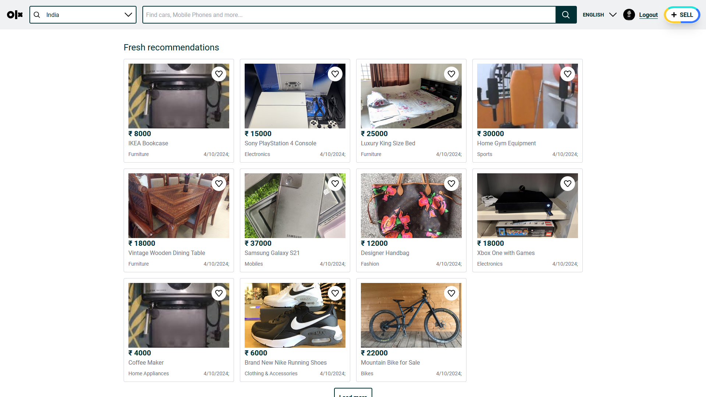
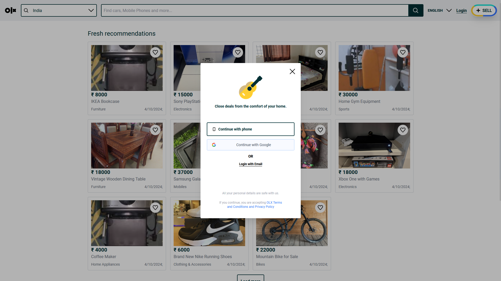
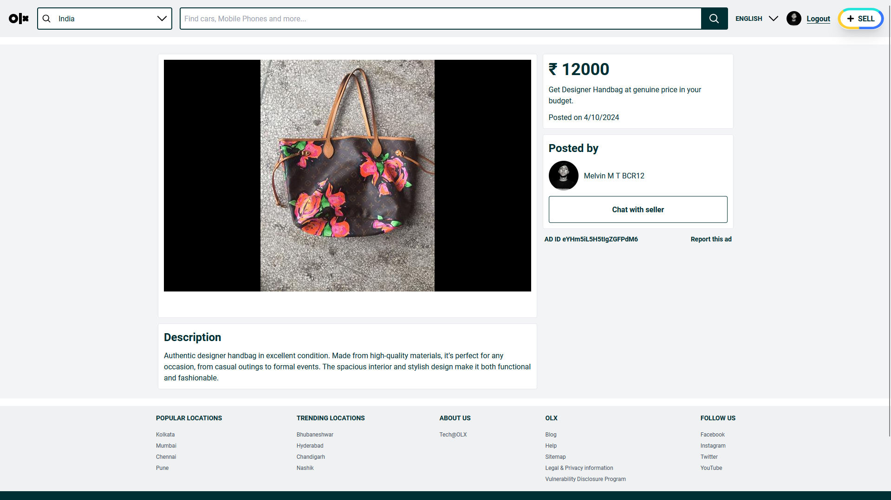
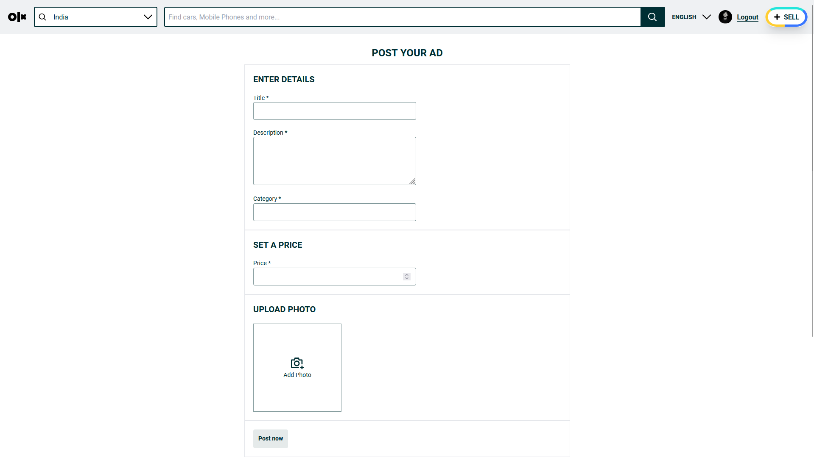

# OLX Clone

This is a simple OLX clone application built using React, TypeScript, Tailwind CSS, Vite, and Firebase. The app features a home page for browsing product listings, user authentication via Google, and a product posting feature.

## Features

- **Home Page**: Browse a list of product posts.
- **Login Page**: User authentication using Google.
- **Create Product Post**: Users can create and submit their own product listings.
- **Post Details Page**: View details for individual product listings.
- **Responsive Design**: Built with Tailwind CSS for a seamless user experience.

## Technologies Used

- **React**: JavaScript library for building user interfaces.
- **TypeScript**: Superset of JavaScript that adds static types.
- **Tailwind CSS**: Utility-first CSS framework for rapid UI development.
- **Vite**: A fast build tool that provides a smooth development experience.
- **Firebase**: Backend service for authentication and data storage.

## Installation

To run this project locally, follow these steps:

1. Clone the repository:

   ```bash
   git clone https://github.com/MelvinThankachan/OLX-Clone.git
   ```

2. Navigate to the project directory:

   ```bash
   cd OLX-Clone
   ```

3. Install the dependencies:

   ```bash
   npm install
   ```

4. Create a `.env` file in the root directory and add your Firebase configuration:

   ```plaintext
    VITE_FIREBASE_API_KEY=your_api_key_here
    VITE_FIREBASE_AUTH_DOMAIN=your_auth_domain_here
    VITE_FIREBASE_PROJECT_ID=your_project_id_here
    VITE_FIREBASE_STORAGE_BUCKET=your_storage_bucket_here
    VITE_FIREBASE_MESSAGING_SENDER_ID=your_messaging_sender_id_here
    VITE_FIREBASE_APP_ID=your_app_id_here
   ```

5. Start the development server:

   ```bash
   npm run dev
   ```

6. Open your browser and visit `http://localhost:5173`. (or the port specified in your terminal).

## Usage

Once the app is running, you can:

- Navigate to the home page to view a list of product posts.
- Use Google authentication to log in.
- Create new product posts.
- View details of individual posts.

## Screenshots










For more screenshots, please check the 'screenshots' folder.

## License

This project is licensed under the MIT License. See the [LICENSE](LICENSE) file for more details.

## Acknowledgements

- [React](https://react.dev/)
- [TypeScript](https://www.typescriptlang.org/)
- [Tailwind CSS](https://tailwindcss.com/)
- [Vite](https://vitejs.dev/)
- [Firebase](https://firebase.google.com/)
